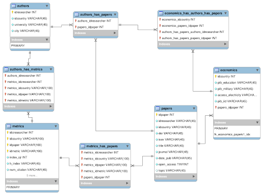

# DataSciCol

## Space Apps Challenge 2002

  - Team members: 
    - [Paola Betancur](https://github.com/orgs/BioAnalyticsCol/people/PABEGA) 
    - [Edimer David](https://github.com/orgs/BioAnalyticsCol/people/Edimer) 
    - [Cristian Rivera](https://github.com/orgs/BioAnalyticsCol/people/riveracrist) 
    - [Sebástian Sanchez](https://github.com/orgs/BioAnalyticsCol/people/sebasanchez07) 
    - [Jonatan Alberto](https://github.com/orgs/BioAnalyticsCol/people/javelezh) 
    - [David Morales](https://github.com/orgs/BioAnalyticsCol/people/damoralesra) 
    

